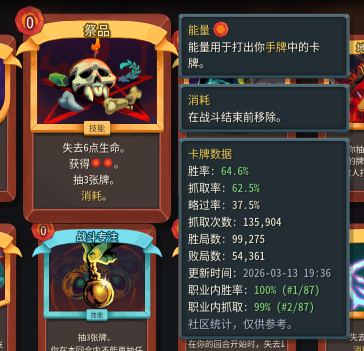
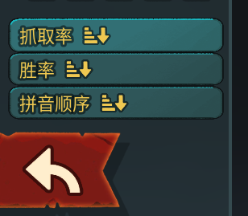
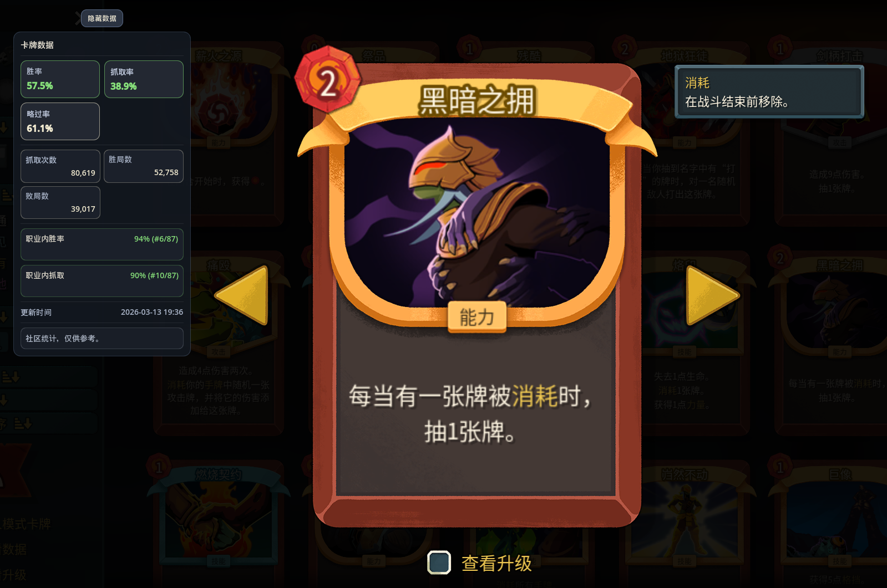

<p align="center">
  <a href="README.md"></a>
  <a href="README.en.md"></a>
  <a href="README.ja.md"></a>
</p>

<p align="center">
  
</p>

<h1 align="center">STS2 Card Stats Overlay</h1>

<p align="center">
  Bring community card stats directly into your Slay the Spire 2 card rewards, card lookup, and deckbuilding flow.
</p>

<p align="center">
  Hover a card to see win rate, pick rate, skip rate, sample size, and in-class ranking.
</p>

<p align="center">
  <a href="https://github.com/XMeowchan/STS2_Card_Stats/releases"><strong>Download Latest</strong></a>
  ·
  <a href="https://github.com/XMeowchan/STS2_Card_Stats/releases">View Releases</a>
</p>

<p align="center">
  
  
  
</p>

<p align="center">
  <a href="#screenshots">Screenshots</a>
  ·
  <a href="#current-highlights">Current Highlights</a>
  ·
  <a href="#installation">Installation</a>
  ·
  <a href="#how-to-use">How to Use</a>
  ·
  <a href="#faq">FAQ</a>
</p>

| Hover to inspect | Stay in game | Reference only |
| --- | --- | --- |
| Key card stats appear beside the tooltip | Drafting, lookup, and deckbuilding stay inside the game | No gameplay changes, no combat changes, no save edits |

## Screenshots

These screenshots show the hover stats panel, card library sorting, and the single-card detail panel.

<table>
  <tr>
    <td align="center" width="50%">
      
      <br>
      <strong>See stats on hover</strong>
      <br>
      Win rate, pick rate, skip rate, and ranking appear right beside the card tooltip.
    </td>
    <td align="center" width="50%">
      
      <br>
      <strong>Sort the card library faster</strong>
      <br>
      Switch between pick rate, win rate, and name sorting to find cards quickly.
    </td>
  </tr>
  <tr>
    <td align="center" colspan="2">
      
      <br>
      <strong>Visible on card details too</strong>
      <br>
      The same stats panel stays available while focusing on a single card.
    </td>
  </tr>
</table>

## Current Highlights

This README currently highlights `v0.2.4`:

- The card library supports sorting by pick rate / win rate for faster evaluation
- The README shows an anonymous user curve so project growth is easier to understand
- Installer, portable package, and release scripts share one build pipeline for more reliable releases

## User Curve

<p align="center">
  
</p>

> This curve comes from the mod's anonymous daily heartbeat. Each install reports at most once per day with only a random install ID. No Steam account, username, or hardware fingerprint is collected.

## What This Mod Does

This Slay the Spire 2 mod adds a stats panel beside card hover tooltips and single-card detail pages, so you can reference community data directly in game.

You can view:

- Win rate
- Pick rate
- Skip rate
- Pick count, wins, losses, and update time
- Relative ranking within the class
- Fast card library sorting by pick rate / win rate

These are community stats for reference only. They do not change card behavior, combat flow, or save files.

## Who It Helps

| Scenario | Benefit |
| --- | --- |
| Card rewards | Judge whether a card is worth taking without switching to a browser |
| Deckbuilding | Compare pick rate, win rate, and class ranking faster |
| Card lookup | Keep the same reference panel in both the library and single-card detail view |

## Installation

The installer is the easiest option.

1. Open [Releases](https://github.com/XMeowchan/STS2_Card_Stats/releases)
2. Download the latest `HeyboxCardStatsOverlay-Setup-version.exe`
3. Close the game first
4. Run the installer
5. Start Slay the Spire 2 after installation finishes

The installer places the mod into the game's `mods` folder automatically.

If you prefer not to use the installer, download `portable.zip` and copy it manually.

## Manual Installation

1. Find the `mods` folder inside your Slay the Spire 2 game directory
2. Copy the full `HeyboxCardStatsOverlay` folder into it
3. Launch the game

Final path:

```text
Slay the Spire 2\mods\HeyboxCardStatsOverlay
```

## Safety Notes

- The installer is not signed with a commercial code-signing certificate yet, so Windows or your browser may warn that the publisher is unknown or the file is uncommon. That usually indicates low reputation, not confirmed malware.
- The only official public download channel is this repository's [GitHub Releases](https://github.com/XMeowchan/STS2_Card_Stats/releases).
- The installer only locates the Slay the Spire 2 folder and copies `HeyboxCardStatsOverlay` into the game's `mods` folder. It does not install services, scheduled tasks, or startup entries.
- If you do not want to run the installer, you can use `portable.zip` and install manually.
- By default, the mod uses the network to pull card stats, check GitHub Releases for updates, and send one anonymous heartbeat for active install counts.
- To disable network behavior, edit `config.cfg` in the mod folder and set `remote_data_enabled`, `mod_update_enabled`, and `telemetry_enabled` to `false`.

## How to Use

After installation, no extra setup is required:

1. Start the game
2. Hover a card
3. Read the stats panel beside it

## FAQ

### The download is flagged as risky or the publisher is unknown

That happens because the installer is not yet signed with a commercial certificate.

If you care about that warning:

- Download only from this repository's GitHub Releases
- Prefer manual installation with `portable.zip`
- Scan the file with Windows Security or your antivirus
- Review the source code yourself, or wait for a later signed release

### What data does this mod upload

- It pulls card stats from a remote source by default
- It checks GitHub Releases for updates by default
- It sends one anonymous heartbeat per day containing only an anonymous install ID, mod version, platform, OS version, and report time

### I installed it but cannot see the stats panel

Check these items first:

- Make sure the game was fully restarted
- Make sure the mod is installed at `Slay the Spire 2\mods\HeyboxCardStatsOverlay`
- If you just updated, restart the game once and check again

### Why do some cards have no data

That usually means the current dataset does not include that card yet.

### Do I need to update the data manually

Normal players do not. Install it and use it directly.

### What does the user curve collect

It only sends an anonymous install ID, mod version, platform, and report time to count cumulative users and daily active installs.

If you do not want to participate in anonymous telemetry, set `telemetry_enabled` to `false` in `config.cfg`.
