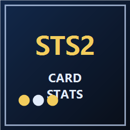

<p align="center">
  
</p>

<h1 align="center">STS2 卡牌统计悬浮窗</h1>

<p align="center">
  把卡牌统计直接带进《Slay the Spire 2》游戏里。
</p>

<p align="center">
  <a href="https://github.com/XMeowchan/STS2_Card_Stats/releases"><strong>下载最新版</strong></a>
  ·
  <a href="https://github.com/XMeowchan/STS2_Card_Stats/releases">查看 Releases</a>
</p>

<p align="center">
  
  
  
</p>

> 安装后，把鼠标停在卡牌上，就能直接看到这张卡的大盘参考数据。  
> 不用切网页，不用查表，也不用手动同步数据。

## 这是什么

这是一个《Slay the Spire 2》Mod，用来在卡牌悬浮提示旁边追加一块统计面板。

你可以在游戏里直接看到一张卡的大盘表现，比如：

- 胜率
- 抓取率
- 略过率
- 抓取次数、胜局数、败局数
- 职业内相对排名

这些数据属于社区统计，仅供参考，不会改动卡牌本身效果、战斗流程或存档。

## 它能带来什么帮助

| 你能得到什么 | 对你有什么帮助 |
| --- | --- |
| 游戏内直接看统计 | 不用反复切网页 |
| 更快判断一张卡值不值得拿 | 选牌更顺手 |
| 构筑时多一层参考 | 决策更有底 |

## 适合谁

适合这些玩家：

- 想在选牌时多一个直观参考
- 不想边打边切网页查数据
- 希望把常用卡牌统计直接放进游戏界面

## 安装方法

推荐直接使用安装包，最省事。

1. 打开 [Releases](https://github.com/XMeowchan/STS2_Card_Stats/releases)
2. 下载最新的 `HeyboxCardStatsOverlay-Setup-版本号.exe`
3. 先关闭游戏
4. 双击运行安装包
5. 安装完成后启动《Slay the Spire 2》

安装程序会自动把 Mod 放进游戏的 `mods` 文件夹。

## 手动安装

如果你拿到的是解压后的文件，而不是安装器，也可以手动安装：

1. 找到《Slay the Spire 2》游戏目录下的 `mods` 文件夹
2. 把整个 `HeyboxCardStatsOverlay` 文件夹复制进去
3. 启动游戏

最终目录类似：

```text
Slay the Spire 2\mods\HeyboxCardStatsOverlay
```

## 怎么使用

安装成功后，不需要额外操作：

1. 进入游戏
2. 把鼠标悬停到卡牌上
3. 在卡牌旁边查看统计面板

## 常见问题

### 安装后没看到统计面板

可以先检查这几项：

- 确认游戏已经完全重启
- 确认 Mod 已安装到 `Slay the Spire 2\mods\HeyboxCardStatsOverlay`
- 如果你刚更新过版本，建议重启一次游戏再看

### 某些卡牌没有数据

这通常不是安装问题，而是当前数据里暂时没有收录这张卡。

### 我需要自己手动更新数据吗

普通玩家不需要。安装好后直接用就行。
